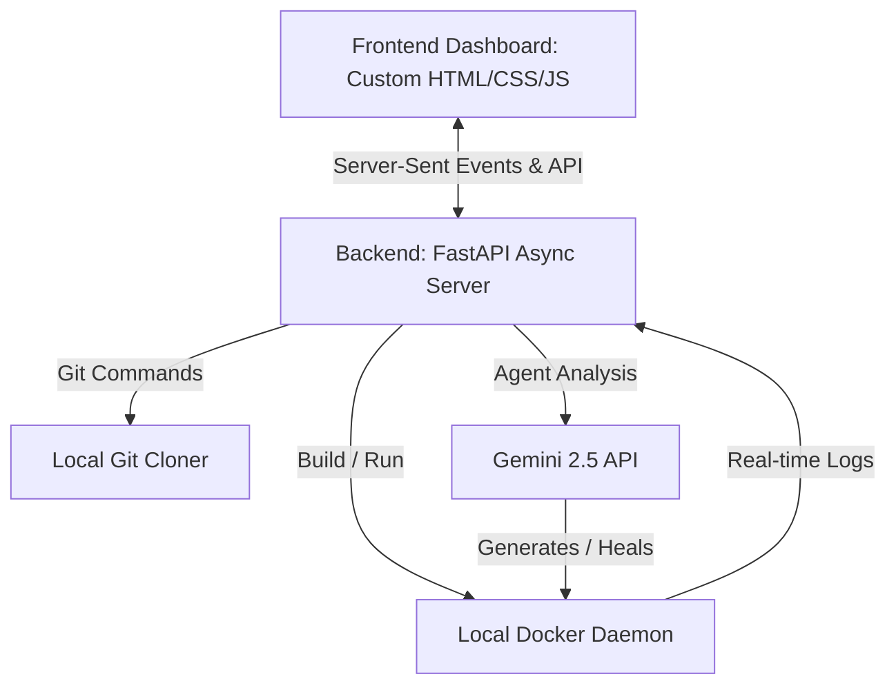

# DockerForge — My AI-Powered Autonomous Dockerfile Generator

Welcome to **DockerForge**, a full-stack autonomous AI agent that I built to automatically containerize any codebase. 

I designed this platform to take a public GitHub repository, scan its files, analyze the primary languages and dependencies, draft tailored configurations, and compile them using local Docker commands. What makes my tool unique is its autonomous self-healing compilation loop. If a build crashes, my agent reads the terminal output, diagnoses the failure, rewrites the Dockerfile, and rebuilds until it achieves a working compile.

---

## Why I Built This and What It Does

Writing Dockerfiles is often a process of trial-and-error: dealing with mismatched base versions, missing compiler headers, or runtime configuration issues. I built DockerForge to automate this workflow. 

### My Key Features:
*   **Deep Repository Analysis**: I clone the target repository and perform a structural analysis of config files (package.json, requirements.txt, pom.xml, go.mod, etc.) to find the stack, ports, and entrypoints.
*   **AI Synthesis**: I integrate Google's Gemini 2.5 model via the `google-genai` SDK as an intelligent Docker Architect to write highly optimized multi-stage Dockerfile and matching docker-compose.yml assets.
*   **Live Compiler Streaming**: I run live docker build commands inside a subprocess and stream the raw output in real-time to a browser terminal emulator.
*   **Autonomous Self-Healing (Max 3 Retries)**: If a build fails, my debugger agent grabs the crash logs, reasons about a fix (like adding missing libs or correcting files), patches the Dockerfile, and rebuilds.
*   **Runtime Container Validation**: Once compiled, I spin up the image, verify it remains active without crashing, check basic health responses, and cleanly clean up.
*   **Simulation/Dry-Run Fallback**: To ensure my application runs out of the box on machines without Docker or active API keys, I built an intelligent Simulation Mode which streams a realistic self-healing demo directly in the UI.

---

## My Technical Architecture

Here is a visual map of how I designed my system components to interact:



### Why I Selected This Stack:
1.  **FastAPI (Backend)**: I used FastAPI because it is extremely fast, fully asynchronous, and supports streaming Server-Sent Events natively. It serves my frontend assets with zero compile overhead.
2.  **Google Gemini 2.5 Flash (AI Agent)**: I chose Gemini 2.5 due to its long context window (essential when passing full project structure and logs) and its advanced reasoning for coding syntax.
3.  **Modern CSS & Vanilla ES6 JS (Frontend)**: Instead of bloated build steps (Vite, React, Webpack), I crafted a high-fidelity dashboard using clean HTML5, custom CSS3 variables, and vanilla JS. I implemented custom glassmorphism panels, glowing borders, and an animated terminal console to give a state-of-the-art developer workspace aesthetic.

---

## How to Set Up and Run My Project

### 1. Prerequisite Environment Check
Ensure you have the following installed on your machine:
*   **Python 3.10+**
*   **Git**
*   **Docker Desktop** (Make sure the Docker daemon is active)

### 2. Install Dependencies
Clone my project, navigate into the directory, create a virtual environment, and install my requirements:

```bash
# Create my python virtual environment
python -m venv .venv

# Activate my virtual environment (Windows PowerShell)
.\.venv\Scripts\Activate.ps1

# Activate my virtual environment (Linux/Mac)
source .venv/bin/activate

# Install all my required dependencies
pip install -r requirements.txt
```

### 3. Environment Settings
Create a `.env` file in the root folder. You can use my `.env.example` as a starting template:

```env
# Paste your Gemini API key here to enable genuine AI generations
GEMINI_API_KEY=your_actual_gemini_api_key

# Set this to true to run in simulated mode without Docker/API Key dependencies
ENABLE_SIMULATION_MODE=false
```

### 4. Run the Application
Start my FastAPI server using uvicorn:

```bash
uvicorn app.main:app --reload
```
Open your browser and navigate to **`http://localhost:8000`** to launch my developer console!

---

## How I Containerized My Own Application (Docker-outside-of-Docker)

I wanted to make DockerForge easily runnable in a container. To achieve this, my container needs access to the host's Docker engine. 

I set this up using a **Docker-outside-of-Docker (DooD)** strategy. My `docker-compose.yml` mounts the host's Docker socket `/var/run/docker.sock` into the container.

### Build and Run using Compose:
```bash
# Spin up my containerized console
docker-compose up --build -d
```
Once active, visit `http://localhost:8000`. The containerized DockerForge will execute genuine image building on your host machine!

---

## Key Edge Cases and My Design Mitigations

*   **Port Collisions**: If multiple apps use port 8080, it will crash. In a future update, I plan to integrate dynamic host-port scanners to select random ports during verification runs.
*   **Private Repositories**: Currently, my agent clones public repositories. For private repositories, I suggest providing a personal GitHub access token within the URL stream (e.g. `https://github.com/username/repo` with token auth).
*   **Complex Multi-Service Applications**: My agent is optimized for single-service containerization. If a repository contains complex microservices requiring databases, I generate a standard single `Dockerfile` and a basic `docker-compose.yml` showing service hooks, which you can adjust manually.
